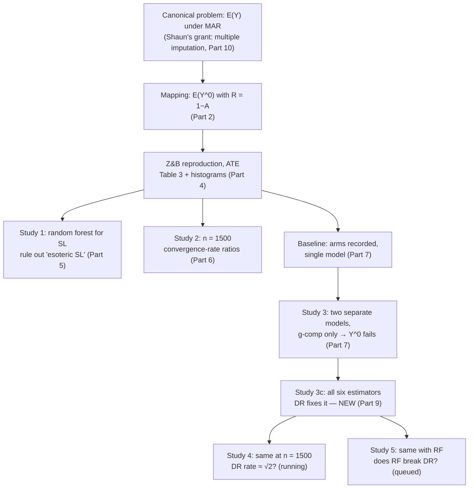

# The Whole Project, Explained — a study report built from the 31 July meeting

*Prepared 2 August 2026 for Nicolas. Structure and arguments follow Shaun's walkthrough in the
recorded supervision meeting (Friday 31 July, 70 min). Every number comes from the project's
results files, **not** from the transcript — spoken numbers transcribe unreliably (Appendix B
lists the corrections). Timestamps like [12:52] point into
`New Recording 51 transcript_timestamped.txt` so you can jump back to the audio.*

**The project in one paragraph.** Statisticians increasingly use machine learning inside
causal/missing-data estimators to avoid trusting hand-written models. Theory warns that the
simplest way of doing this — g-computation: fit an ML model, predict everyone's outcome,
average — produces estimates whose *error shrinks too slowly with sample size*, leaving a bias
comparable to the standard error and confidence intervals that miss far more than 5% of the
time. Almost nobody has demonstrated this concretely. This project reproduced the best existing
demonstration (Zivich & Breskin 2021), then re-engineered it, step by step, into the exact form
Shaun's real problem (missing data, one outcome, per-arm models) requires — and showed the
failure survives every re-engineering (studies 1–3), is visible directly in the error scaling
(study 2), and is repaired by the doubly-robust estimators AIPW and TMLE, especially with
cross-fitting (Table 3; study 3c). One number to remember: with ML nuisances, g-computation's
95% intervals for E(Y⁰) cover **68.6%**; cross-fit TMLE's cover **94.7%**.

**How to use this document.** Parts 1–3 rebuild *why* the project exists — the part Shaun calls
genuinely hard ("what's difficult is understanding why you've done it, what you've done, and
what you conclude from it" [~1:04]). Parts 4–9 walk every result with one small toolkit of
formulas, so each coverage number is *predicted*, not just reported. Parts 10–12: the
motivation he revealed, the demonstrated/not-demonstrated inventory, the talk. Appendices:
glossary, transcript corrections, file map.

---

## Part 1 — The problem behind everything: one number, with holes in the data [00:00]

**In one sentence: estimating a simple average is hard once the data has holes that opened
non-randomly, and every honest fix needs a fitted model — which is where the trouble starts.**

> *"What do you do if you want to estimate the expectation of some variable Y, when you've got a
> sample, but Y is missing for some of the people in your sample?"* [00:00]

You want one number, the population mean **E(Y)**. Some people's Y was never recorded. For
everyone you observe covariates **X**. Write **R = 1** if Y is observed, **R = 0** if missing.

**Why you can't just average the observed Y's — a 40-second toy.** Suppose the population is
half "high-risk" (X = 1, true mean Y = 0.5) and half "low-risk" (X = 0, true mean Y = 0.1), so
E(Y) = 0.3. Doctors measure Y on 90% of high-risk but only 50% of low-risk patients. The
observed sample then over-represents high-risk people (90 : 50), and the naive average of
observed Y's is (90×0.5 + 50×0.1)/140 = **0.357**, not 0.3 — biased by +0.057 *no matter how
large the sample is*. The holes opened in a way that depends on X, so the remaining data is
tilted.

**The assumption that makes the problem solvable — MAR** [00:04]. *Missing at random*: within
each level of X, missingness tells you nothing further about Y — formally, R ⟂ Y given X. In
the toy: among high-risk patients, *which* 90% got measured is effectively random. Missingness
may depend on X (it does), but not on Y beyond X.

**The three repair strategies** [00:06–02:30], each written both in words and as a recipe.
Let m̂(x) ≈ E(Y | X = x) be a fitted *outcome model* and π̂(x) ≈ P(R = 1 | X = x) a fitted
*missingness (propensity) model*. These are the **nuisance models** — you must fit them, but
they are only ingredients.

1. **G-computation** (= regression imputation): fit m̂ on the observed-Y people, predict Y for
   *everyone*, average the predictions.
   **Estimate = mean over all i of m̂(Xᵢ).**
   In the toy: m̂ learns 0.5 and 0.1, you average over the *true* half/half population mix →
   0.3. Correct — *if m̂ is good.*
2. **IPW** (inverse probability weighting, Hajek form): average the *observed* Y's, weighting
   each by 1/π̂(Xᵢ) so under-measured groups count more, then divide by the sum of weights.
   **Estimate = Σ(observed) Yᵢ/π̂(Xᵢ) ÷ Σ(observed) 1/π̂(Xᵢ).**
   In the toy: low-risk patients get weight 1/0.5 = 2, high-risk 1/0.9 ≈ 1.1, which exactly
   undoes the 90 : 50 tilt → 0.3. Correct — *if π̂ is good.*
3. **AIPW** (augmented IPW; TMLE achieves the same goal a different way): use both —
   g-computation's prediction for everyone, **plus** the observed people's residuals scaled up
   by their weights.
   **Estimate = mean over all i of [ m̂(Xᵢ) + Rᵢ · (Yᵢ − m̂(Xᵢ)) / π̂(Xᵢ) ].**
   The correction term repairs m̂'s mistakes wherever data exists to see them.

**The precise reason doubly-robust methods tolerate machine learning.** AIPW/TMLE have two
protections. The famous one: the estimate is consistent if *either* nuisance model is right
("doubly robust"). The one this project turns on is sharper: their first-order error is a
**product** of the two nuisance errors,
error ≈ (error in m̂) × (error in π̂),
so if each model converges at the lazy rate n^(−1/4), the product shrinks at n^(−1/4) × n^(−1/4)
= n^(−1/2) — the full parametric "root-n" rate. Machine learning *can* usually manage n^(−1/4).
G-computation has no product: its error is simply the average error of m̂ itself, so it needs m̂
alone at n^(−1/2) — which flexible ML generally **cannot** deliver. That is the entire
theoretical claim, in one line [02:55]:

> *"If you do use data-adaptive methods, then you have these problems of slow* [convergence,
> giving] *bias and poor coverage of confidence intervals… There are a lot of papers claiming
> that this is a problem, but nobody's demonstrated it."*

Demonstrating it — and its repair — is the project. The only convincing existing
demonstrations, both for the *treatment-effect* twin of this problem (Part 2): Zivich &
Breskin (2021), and Ashley Naimi's group.

---

## Part 2 — Your ATE problem is the missing-data problem, twice over [03:20]

**In one sentence: estimating the untreated mean E(Y⁰) is *literally* Part 1's problem after a
change of notation, so anything you show for one arm transfers to Shaun's world.**

Every person has two *potential outcomes*: Y¹ (outcome if treated) and Y⁰ (outcome if
untreated). The average treatment effect is ATE = E(Y¹) − E(Y⁰). You observe the outcome
matching the treatment A actually received — the other is missing:

> *"For each of the people in your sample, you observe one of those and the other one's
> missing… which is exactly the same problem that I've just described with the missing Y."*
> [03:40]

The dictionary, exactly:

| Missing-data problem (Part 1) | Causal problem (this project) |
|---|---|
| variable of interest Y | Y⁰ (or Y¹) |
| target E(Y) | E(Y⁰) (or E(Y¹)); ATE = difference |
| covariates X | confounders Z (age, LDL, diabetes, risk score) |
| observed-indicator R | 1 − A for Y⁰ (A for Y¹) |
| MAR: R ⟂ Y given X | no unmeasured confounding: A ⟂ (Y¹,Y⁰) given Z |
| positivity: π(x) > 0 for all x | everyone has some chance of each treatment |

(Positivity is the quiet extra assumption; in all project code the fitted propensities are
clipped to [0.01, 0.99] so no weight exceeds 100.)

This mapping is why Shaun keeps insisting on the **arms separately** rather than the ATE: his
real problem has only one Y. A phenomenon visible only in the *difference* of two arms is
useless to him; a phenomenon in a *single arm* transfers verbatim.

---

## Part 3 — Why reproducing Zivich & Breskin wasn't enough [08:00]

**In one sentence: Z&B prove the right theorem in the wrong dialect — ATE only, and a single
outcome model that is illegal in the missing-data world — so the project translates their
demonstration rather than merely repeating it.**

Z&B simulate datasets of n = 3,000 (this project uses their first 1,000 datasets throughout,
same seeds, so every study sees identical data) from a statins-and-cardiovascular-disease
mechanism, then compare estimators under three nuisance specifications:

- **True** — correct parametric models (the simulation's actual functional forms);
- **Main-effects** — parametric with the right variables but wrong shapes (misspecified);
- **Machine learning** — a super learner: a cross-validated weighted blend of a library
  including logistic regressions, GAMs, a 500-tree random forest and a neural network.

Two obstructions for Shaun's purposes, which generated the entire study programme:

**Obstruction 1 — they report only the ATE.** No E(Y¹) or E(Y⁰) anywhere ("helpfully, they
didn't give any results for Y1 and Y0" [09:35] — irony). *Fix: record the arms.*

**Obstruction 2 — one outcome model, not two.** Their outcome model regresses observed Y on Z
*and A jointly* (one super learner with the treatment indicator as a feature), then predicts
twice (A set to 1, A set to 0). The missing-data problem cannot imitate this:

> *"I can't estimate the expectation of Y given X by using the Y values of the people for whom Y
> is observed **and** the Y values of those who are missing. It's just impossible."* [10:00]

When Y is missing you have nothing to put in the regression. The only legal construction fits
E(Y | X) **on observed-Y people only** — translated: fit the Y⁰ model **on untreated people
only**; no individual with A = 1 may ever enter it. *Fix: two separate models — the design rule
of studies 3, 3c, 4, 5.*

---

## Part 4 — The toolkit for reading every table, then Table 3 read with it [12:52]

**In one sentence: two ratios — bias/ESE and ASE/ESE — predict every coverage number in this
project to within about a percentage point, so learn the two ratios and every table becomes
self-explanatory.**

**The measurement setup.** Each study runs 1,000 simulated datasets. Each dataset yields one
estimate and (for most estimators) one estimated standard error; the 95% confidence interval is
estimate ± 1.96 × SE. Because the simulation's truth is known, we can score everything:

- **Bias** = (average of the 1,000 estimates) − truth.
- **ESE**, *empirical* SE = standard deviation of the 1,000 estimates — the estimator's *actual*
  precision, which only a simulation can see.
- **ASE**, *average* SE = mean of the 1,000 estimated SEs — what the method *believes* its
  precision is. Honest inference needs ASE ≈ ESE.
- **Coverage** = fraction of the 1,000 intervals containing the truth. Nominal: 0.95. With
  1,000 replications, coverage is itself measured with Monte-Carlo error ≈ ±0.7 percentage
  points — differences smaller than that are noise.
- G-computation here reports **no analytic SE**; by Shaun's design its intervals use the ESE
  itself ("empirical-SE CIs"), and coverage columns are marked accordingly.

**The coverage formula.** Picture the 1,000 estimates as a bell curve of width ESE, centred
bias-away from the truth. Define two ratios:
**b = |bias| / ESE** (how many SDs the curve sits off-target) and
**c = ASE / ESE** (how honest the claimed SE is; c = 1 for empirical-SE intervals by
construction). Then, assuming approximate normality — which the histograms verified [~18:30] —

**coverage ≈ Φ(1.96·c − b) − Φ(−1.96·c − b)**,  Φ = normal CDF.

Handy honest-interval ladder (c = 1): b = 0 → 95%; b = 0.5 → 93%; b = 1 → 83%; b = 1.5 → 68%;
b = 2 → 48%; b = 2.5 → 30%. **Moral: bias costs little until it reaches about half a standard
error, then coverage falls off a cliff.** This is why Shaun's first glance at any row is
bias-versus-ESE [13:40].

**The formula against every headline number of the project:**

| Cell | b = bias/ESE | c = ASE/ESE | predicted | observed |
|---|---|---|---|---|
| Table 3, g-comp, ML | 1.58 | 1 (emp.) | 0.648 | **0.640** |
| Table 3, g-comp, Main-effects | 1.27 | 1 (emp.) | 0.756 | 0.768 |
| Baseline, E(Y⁰), ML | 1.29 | 1 (emp.) | 0.749 | 0.751 |
| Study 1, ATE, random forest | 2.46 | 1 (emp.) | 0.307 | **0.300** |
| Study 3, E(Y⁰), ML | 1.45 | 1 (emp.) | 0.695 | **0.686** |
| Table 3, IPW, ML (own SE) | 0.55 | 1.081 | 0.938 | 0.937 |
| Table 3, AIPW, ML (own SE) | 0.22 | 0.864 | 0.902 | 0.908 |
| Table 3, TMLE, ML (own SE) | 0.07 | 0.820 | 0.891 | 0.901 |
| Table 3, SC-TMLE, ML (own SE) | 0.04 | 0.999 | 0.950 | 0.938 |

Every observed coverage is the arithmetic consequence of its own bias and SE-honesty. Nothing
else is going on in any table of this project.

**Table 3 itself** (ATE, 1,000 datasets, truth −0.108151; full three-panel version in
`table3_reproduction.csv`). Machine-learning panel:

| Estimator (ML nuisances) | Bias | ESE | ASE | Coverage |
|---|---|---|---|---|
| G-computation | **+0.0264** | 0.0167 | — | **0.640** (emp.) |
| IPW | +0.0115 | 0.0210 | 0.0227 | 0.937 |
| AIPW | +0.0043 | 0.0192 | 0.0166 | 0.908 |
| TMLE | −0.0014 | 0.0201 | 0.0165 | 0.901 |
| SC-AIPW (cross-fit) | −0.0029 | 0.0235 | 0.0221 | 0.935 |
| SC-TMLE (cross-fit) | +0.0008 | 0.0205 | 0.0205 | 0.938 |

Shaun's reading [13:30–19:00], now with the mechanism visible:

- **Sanity rows first.** True parametric: everything unbiased, coverage ≈ 0.95 (g-comp 0.948) —
  "exactly what you'd expect." Main-effects: g-comp bias −0.0223 (b = 1.27) → 0.768 — the cost
  of misspecification, i.e. the reason people want ML in the first place.
- **G-computation + ML is the demonstrated failure.** b = 1.58 → 64%. This is Part 1's
  slow-convergence bias, live.
- **IPW + ML "got lucky"** [15:30]. Real bias (b = 0.55 — on the honest ladder that alone
  predicts ≈ 93%) *plus* over-wide intervals (c = 1.08) that cancel the loss → 0.937.
  *"In another simulation study, using a different data-generating mechanism, you would have
  demonstrated poor coverage as well."* A dodged bullet, not an acquittal — one reason he is
  "much less interested" in IPW.
- **AIPW/TMLE without cross-fitting: tiny bias, dishonest SE.** The doubly-robust structure
  kills the bias (b ≤ 0.22) but the intervals are too narrow (c ≈ 0.82–0.86) → 0.90–0.91. Why
  narrow? Each observation's data was used twice — to fit the nuisances *and* to evaluate its
  own correction term — and that reuse is only harmless when the nuisance estimator is limited
  in flexibility: the **Donsker condition**, *"fairly flexible, but not too flexible. And
  something like a random forest is too flexible, or a neural net"* [17:11]. The super learner
  violates it.
- **Cross-fitting removes the Donsker requirement** [18:10]. Nuisances are fitted on folds that
  exclude the observation being evaluated, so nothing sees its own reflection: c snaps to 1.00
  (SC-TMLE: ASE 0.0205 vs ESE 0.0205), b ≈ 0, coverage 0.94.

**The histograms** [~18:30] certify the formula's normality assumption: every panel that
matters is approximately bell-shaped, with bias visible as the whole bell sliding off the
truth line — so mean ± SD (and hence b, c) tells the whole story.

---

## Part 5 — Study 1: swap the super learner for a plain random forest [23:12]

**In one sentence: the failure is not an artifact of Z&B's elaborate ensemble — a plain random
forest fails harder (ATE coverage 30%), and both arms fail with opposite-signed biases that add
up in the ATE.**

**Question**: is there *"something rather esoteric about their super learner"* driving the
result? **Design**: baseline design, ML spec replaced by one 500-tree random forest,
g-computation only. `study1_tables.csv` (truths: E(Y¹) = 0.23387, E(Y⁰) = 0.34194):

| Estimand (RF nuisance) | Bias | ESE | b | Coverage (emp.) |
|---|---|---|---|---|
| E(Y¹) | +0.0254 | 0.0146 | 1.74 | 0.610 |
| E(Y⁰) | −0.0140 | 0.0094 | 1.49 | 0.669 |
| ATE | **+0.0395** | 0.0160 | **2.46** | **0.300** |

Note the arithmetic of the arms: Y¹ biased **up** (+0.0254), Y⁰ biased **down** (−0.0140), and
the ATE — their difference — collects both: +0.0254 − (−0.0140) = +0.0395. "In line with the
results you got using a super learner, except that it's even more extreme."

Deliberately left open, and answered by study 5: *"we don't know how well AIPW or TMLE would do
with a random forest… It would be interesting to know"* [24:50] — if RF broke the doubly-robust
estimators too, the recommended fix would look fragile.

---

## Part 6 — Study 2: half the sample size makes the *rate* visible [26:11]

**In one sentence: halving n multiplies a well-behaved estimator's SE by √2 ≈ 1.414 — the
parametric specs hit 1.40–1.41 on the nose while the ML spec manages only 1.29, which is slow
convergence measured directly rather than inferred.**

**Design**: baseline design at n = 1,500 — the *first 1,500 rows of the same datasets*, so the
only change is sample size. Two purposes:

**Purpose 1 — the data-dredging check** [28:00]. Could Z&B have searched over sample sizes
until one flattered their story? At n/2 the g-comp ML coverage is 0.598 (vs 0.640) — still
broken. *"I'm reassured… they didn't have to choose a sample size of 3,000 to make their
point."*

**Purpose 2 — measure the convergence rate.** The three-line derivation he walked you through
[29:30]: if SE ∝ n^(−a), then
SE(1500) / SE(3000) = (1500/3000)^(−a) = **2^a**.
So the ESE ratio *is* a measurement of a: ratio 1.414 ⇒ a = ½ (the parametric root-n rate);
ratio 1.260 ⇒ a = ⅓. Inverting: **a = log₂(ratio)**. From
`study2_tables.csv` ÷ `baseline_tables.csv` (g-computation):

| Estimand | True ratio | Main-effects ratio | ML ratio |
|---|---|---|---|
| E(Y¹) | 1.45 | 1.45 | 1.35 |
| E(Y⁰) | 1.39 | 1.39 | 1.36 |
| ATE | 1.41 | 1.40 | **1.29** |
| implied a (ATE) | **0.50** | 0.49 | **0.37** |

Precision notes worth having ready: (i) each ESE is estimated from 1,000 replications with
relative error ≈ 2.2%, so a ratio carries ≈ ±0.045 — the ML ratio 1.29 is **three standard
errors below √2** (clearly sub-parametric) though not precisely pinned between ∛2 = 1.26 and
1.29; (ii) the *misspecified* parametric model still scales at √2 — misspecification biases the
**level**, not the **rate**; (iii) in the meeting he quoted 1.44 and 1.27 by dividing rounded
table entries — exact values above. The inheritance claim, in his words:

> *"The estimates of the expectation of Y given X that you get from the machine-learning method
> themselves converge slowly, and the G-computation estimator, which is just an average of those
> estimates, inherits that slow convergence."* [31:45]

---

## Part 7 — Baseline and Study 3: record the arms, then split the models

**In one sentence: with arms recorded, the single-model ATE bias splits into two opposite-signed
arm biases; and when the models are split per arm — the missing-data-legal construction — Y¹
happens to behave but Y⁰ fails exactly as Shaun's problem needs (b = 1.45, coverage 68.6%).**

**The baseline** (Z&B's single joint model, arms recorded; `baseline_tables.csv`, ML spec):
E(Y¹) bias +0.0138 (coverage 0.827), E(Y⁰) bias −0.0126 (coverage 0.751), and the ATE collects
both: +0.0138 − (−0.0126) = +0.0264 (coverage 0.640) — your pre-meeting-email observation, his
starting point. This baseline is also, note, the answer to his end-of-meeting request (Part 13).

**Study 3 — the pivot of the project** [~33:00]. Two *separate* super learners: E(Y | A=1, Z)
fitted on the 
treated only, E(Y | A=0, Z) fitted on the untreated only — no treated individual
ever touches the Y⁰ model. G-computation only. `study3_tables.csv`, ML spec:

| Estimand | Bias | ESE | b | Coverage (emp.) |
|---|---|---|---|---|
| E(Y¹) | −0.0008 | 0.0164 | 0.05 | 0.958 |
| E(Y⁰) | **−0.0174** | 0.0120 | **1.45** | **0.686** |
| ATE | +0.0167 | 0.0198 | 0.84 | 0.853 |

His live reaction [34:38]: for Y¹, *"very little bias, and the coverage is very good — when I
saw that, I was a bit disappointed. But then I saw this result for Y⁰, and I was **very
pleased**."* Why pleased by a failure — the one-line version of Part 10:

> *"I would treat Y⁰ as the Y that I'm interested in. I'd forget all about Y1… And now I've got
> an illustration that, for my problem, G-computation with machine learning can cause
> problems."* [35:20]

**Why the asymmetry (Y¹ fine, Y⁰ broken)?** Your question; his answer [37:46]: none should be
*expected*. The two arms pose two genuinely different learning problems: setting A = 0 in the
data-generating formula deletes some terms and keeps others, so the Y⁰ regression the ML must
learn is a different (and here evidently harder) function than the Y¹ regression; likewise the
"missingness" model for Y⁰ is 1 − (the statin model), not the statin model. And one failing arm
suffices: *"I don't have to demonstrate that it **always** causes a problem."* [36:30]

**Two asides worth keeping from this stretch:**

- **Your cross-fitting is the standard one** [37:14]. Z&B used *double* cross-fitting with
  repeated fold draws — "perfectly acceptable but very little used… I don't know why they did
  what they did, it's a bit weird." You used *single* 5-fold cross-fitting, one split — "much
  more common. So that's nice as well: you've demonstrated the performance of a much more
  commonly used method."
- **The honest limitation** [44:22]. Re-reading Z&B's statin model as a missingness model is
  contrived ("anybody looking at this could reasonably say: that's a bit weird — why have you
  chosen that?"). A realistic-missingness redesign is the natural next step — *"but you're not
  going to do that. I'm very happy with what you've done"* — known limitation, explicitly out
  of scope, one honest sentence in the talk.

---

## Part 8 — The current programme: studies 3c, 4, 5 [45:30]

**In one sentence: the same two-model E(Y⁰) design, now with all six estimators sharing one set
of nuisance fits, at n = 3000 (3c: does DR fix it?), n = 1500 (4: at what rate?), and with a
random forest (5: does RF break even DR?).**

All three run `e0_studies.py` (project-written; validated against Z&B's own estimator code to
machine precision on identical inputs). Per dataset and specification: **12 ML fits** — 1
propensity model + 1 untreated-only outcome model on the full sample (shared by IPW, g-comp,
AIPW, TMLE), plus 1 of each per fold for the five folds (shared by SC-AIPW and SC-TMLE).
Estimators of E(Y⁰) only: g-computation, IPW (Hajek), AIPW, TMLE, SC-AIPW, SC-TMLE.
SEs from influence functions where they exist; g-comp uses empirical-SE intervals.

| Study | Change vs study 3 | Question | Status |
|---|---|---|---|
| **3c** | all six estimators, SL, n = 3000 | *"We don't actually know whether AIPW or TMLE would be any better"* [46:10] | **done 1 Aug → Part 9** |
| **4** | same, n = 1500 | do cross-fit AIPW/TMLE earn ratio ≈ 1.41 (√2) while g-comp stays ≈ 1.3? [46:40] | running, ≈ 60% left |
| **5** | same, random forest | *"Maybe it would be rubbish… I don't expect it would. But you can find out whether it does."* [47:20 + 1:00:30] | queued, auto-starts after 4 |

---

## Part 9 — NEW: study 3c results (finished 1 Aug, not yet discussed with Shaun)

**In one sentence: the doubly-robust estimators fix the study-3 failure — bias falls by an
order of magnitude and coverage returns to 0.92–0.96, with cross-fitting restoring honest SEs —
so the disease and the cure now coexist in the missing-data-legal construction.**

From `study3c_results_*.csv` via `build_e0_outputs.py` (1,000 datasets; 998 for the SC methods —
two datasets lost only their SC values to a silent numerical failure in the super learner's GAM
member, logged and documented). **E(Y⁰), ML nuisances, two separate models** (truth 0.34194;
full table with parametric panels in `study3c_tables.csv`):

| Estimator | Bias | ESE | ASE | b | c | Cov. (own SE) | Cov. (emp. SE) |
|---|---|---|---|---|---|---|---|
| G-computation | **−0.0174** | 0.0120 | — | 1.45 | — | — | **0.686** |
| IPW | −0.0061 | 0.0136 | 0.0155 | 0.45 | 1.14 | 0.931 | 0.922 |
| AIPW | −0.0025 | 0.0125 | 0.0114 | 0.20 | 0.91 | 0.924 | 0.947 |
| TMLE | +0.0010 | 0.0126 | 0.0109 | 0.08 | 0.87 | 0.926 | 0.958 |
| SC-AIPW | +0.0047 | 0.0266 | 0.0187 | 0.18 | 0.70 | 0.947 | 0.946 |
| SC-TMLE | −0.0030 | 0.0137 | 0.0139 | 0.22 | 1.01 | 0.938 | 0.947 |

Read with the Part-4 toolkit, in the order Shaun would:

1. **Validation first.** The g-computation row equals study 3's at all four printed decimals
   (bias −0.0174, ESE 0.0120, coverage 0.686), though computed by a different, shared-nuisance
   driver — strong internal check of `e0_studies.py`.
2. **The answer to 3c's question: yes, dramatically.** Bias −0.0174 → −0.0025 (AIPW) and
   +0.0010 (TMLE); every doubly-robust coverage in the 0.92–0.96 band. The Table-3 pattern
   transfers intact to the single-arm two-model setting: small bias everywhere, mild own-SE
   undercoverage without cross-fitting (c ≈ 0.87–0.91 → 0.92–0.93), honest SEs with it
   (SC-TMLE c = 1.01 → 0.938 own-SE, 0.947 empirical). **For Shaun's story this is the missing
   half: the disease (g-comp fails for E(Y⁰)) now comes with the cure (DR + cross-fitting) in
   the same legal construction.**
3. **Fine print, quantified.** SC-AIPW's spread is large (ESE 0.0266 ≈ 2.1 × AIPW's 0.0125) —
   the price of a single 5-fold split *and* of this driver's zepid-mirroring scheme in which
   each fold's nuisances are trained on one fold (n/5 = 600 observations), not on the
   complementary four-fifths; its own-SE coverage is nonetheless fine (0.947). Its ASE also
   understates that spread (c = 0.70) — coverage survives because b is small; worth one honest
   sentence, not a worry. IPW again shows the "lucky" signature in miniature (b = 0.45, c =
   1.14). The parametric panels behave (True: 0.94–0.96 everywhere; Main-effects: distorted) —
   sanity intact.

When study 4 lands: run `build_e0_outputs.py --prefix study4`, divide each estimator's ESE by
its 3c value, and compare to 1.414 (√2, the parametric rate) vs ≈ 1.29 (g-comp's known
slowness). Expectation stated in the meeting [46:40 + 59:50]: cross-fit AIPW/TMLE ≈ √2,
g-computation slower. Each ratio carries ≈ ±0.045.

---

## Part 10 — Why this matters to him: the London project [51:55]

**In one sentence: his grant's first milestone is demonstrating that multiple imputation — 
g-computation's sibling — fails with ML nuisances, his team was stuck even showing it for
g-computation, and your study-3 Y⁰ counterexample is the demonstration they were missing.**

Answering your direct question — *"is that why you wanted me to focus on G-computation? Because
you already knew there was a problem?"*:

- He holds a **grant with a collaborator in London, funding a postdoc**, on debiased machine
  learning for a missing-data problem — *"the same flavour"* as Part 1.
- That problem is standardly solved with **multiple imputation (MI)**, which is *"of the same
  sort of flavour as g-computation"* — it also rests on fitted E(Y | X)-type nuisance models,
  so ML-driven MI should inherit the same slow-convergence disease.
- Milestone 1: **demonstrate MI fails with ML** — because *"if we can't demonstrate there's a
  problem with multiple imputation, then when we develop new methods, people are just going to
  say: you didn't need those methods, why did you waste your time?"*
- They were struggling — even for g-computation ("I kind of feel we're not trying hard enough,
  but we're struggling"). He had told colleagues to mine Z&B and Naimi for data-generating
  mechanisms; they started elsewhere.
- His own prior attempt (from a course he taught): a colleague's example showed the failure with
  a *single* joint model — but **switching to two separate super learners made the problem
  vanish** [57:31]. His algebraic repair yielded *"a really kind of weird data-generating
  mechanism"* with only ~85%-ish coverage — *"not quite as persuasive."*
- **Study 3 changed that**: coverage below 70%, in a published and justified DGM, under the
  two-separate-models construction his problem demands. *"Because you've demonstrated the
  problem here, I don't need to go into all the algebra and do my little trick."* [50:45]

The quiet punchline of the internship: the reproduction wasn't an exercise *about* Z&B — it
manufactured the precise counterexample his grant's first milestone needed.

---

## Part 11 — Demonstrated vs not demonstrated [57:00]

**In one sentence: five claims are now backed by your tables, four are honestly open — and the
list is your conclusions slide.**

**Demonstrated:**
1. **G-computation with ML nuisances fails for the ATE** — bias 1.6 × ESE, coverage 64%
   (Z&B's message, independently reproduced with their design).
2. **The failure is robust to the obvious outs**: not their exotic super learner (study 1 —
   plain RF is *worse*, 30%), not their sample size (study 2 — n/2 still fails, 59.8%), not
   their unusual double cross-fit (all your results use the common single cross-fit).
3. **Two separate super learners do not rescue g-computation** (study 3: Y⁰ at 0.686) — *"that
   may not seem super interesting to you; it's super interesting to me"*, because in his own
   example that switch made the problem disappear.
4. **The slow rate is visible directly** (study 2: parametric ratios 1.40–1.45 ≈ √2; ML 1.29,
   three standard errors below) — *"Zivich and Breskin didn't do that, because they only had one
   sample size."*
5. *(New, Part 9)* **AIPW/TMLE repair the two-model E(Y⁰) failure**, with cross-fitting
   restoring honest SEs — coverage 0.92–0.96.

**Not demonstrated (say so plainly):**
1. IPW + ML failing — this DGM lets IPW off (b = 0.55 masked by c = 1.08; "maybe they're lucky
   or unlucky, depending on how you view it").
2. Whether a plain random forest breaks AIPW/TMLE → study 5, queued.
3. Whether cross-fit AIPW/TMLE earn the √2 rate in the arm setting → study 4, running.
4. Any of this under a *realistic missingness* mechanism → future work beyond the internship.

---

## Part 12 — The talk (11 August), as he framed it [1:01:28]

**In one sentence: first make the audience understand the disease and the cure in plain terms,
then explain why Z&B left questions open, then show your tables proving the point — and use his
three standing offers.**

**Format**: 20 min = 15 + 5 questions. **Audience**: MRC Biostatistics Unit — other interns,
PhD students, possibly the unit director; mixed experience, many new to debiased ML; *"the
audience will be lovely… if they don't ask you any questions, that means they're a rubbish
audience."*

**His prescribed narrative** (mapping onto this report):
1. *The essential message* (Parts 1, 2, 4): what goes wrong with g-computation/IPW under ML
   nuisances and how AIPW/TMLE + cross-fitting fix it. Depth is your choice: *"you don't have
   to talk about efficient influence functions and Donsker conditions and stuff."* The Part-4
   ladder (bias at 1.5 SEs ⇒ ~68% coverage) is a talk-sized way to make failure concrete.
2. *Why reproduce Z&B* (Part 3): *"you — or we — are a bit unsatisfied with their results.
   There are other things we want to know, and they haven't given us those answers"* — no arms,
   single model, one sample size, uncommon cross-fit variant.
3. *Your results* (Parts 5–9): the Part-11 inventory, with study 3's Y⁰ row as centrepiece and
   3c as the repair.

**His reassurances, for when nervous** [1:03–1:06]: most interns did something *less*
complicated; the difficulty of yours lives in the understanding — *"why you've done it, what
you've done, and what you conclude… probably harder than what many of the other interns have
done"*; and *"you taught yourself much of this… it's not as though you've just been following
instructions."*

**Standing offers**: multiple slide drafts [1:06:49]; a practice run over Zoom with his notes;
his script-with-bullet-points format — send yours too [1:07:13].

---

## Part 13 — Small things not to lose

- **The baseline pointer** [1:08:18]. His final request — Z&B's *original single-model* design,
  E(Y¹) and E(Y⁰) for g-computation only — is exactly the `baseline_*` run emailed at 12:34 on
  31 July, hours before the meeting. Nothing to rerun: point him to `baseline_tables.csv` /
  `baseline_histograms.pdf` in the next mail (alongside the new 3c table).
- **Your name** [1:08:42]. *You* corrected *him*: it's **Nicolas**, no H — "the French way" —
  he had been writing "Nicholas". He apologized ("I can see it now on your Zoom window").
- **The two NaN datasets** (3c, sims 154 & 831, SC methods only): one fold's GAM inside the
  super learner returned NaN predictions after a PIRLS divergence — silently, so the driver's
  retry logic (which triggers on *exceptions*) never fired. 998/1000 is ample; keep the
  footnote for honesty.

---

## Appendix A — Glossary (plain words first, precision second)

- **Estimand / estimator / estimate**: the number you want / the recipe / the value the recipe
  returns on one dataset.
- **Potential outcomes Y¹, Y⁰**: a person's outcome if treated / if untreated; exactly one is
  observed. **ATE** = E(Y¹) − E(Y⁰).
- **MAR**: R ⟂ Y given X — within levels of X, missingness is uninformative about the missing
  value. Causal twin: **no unmeasured confounding**, A ⟂ (Y¹, Y⁰) given Z.
- **Positivity**: every covariate pattern has non-zero probability of each observation status;
  enforced here by clipping propensities to [0.01, 0.99].
- **Nuisance models**: the outcome model m̂(x) ≈ E(Y | X = x) and propensity model
  π̂(x) ≈ P(R = 1 | X = x) — fitted only as ingredients.
- **G-computation**: average of m̂(Xᵢ) over everyone ("regression imputation"). Error = average
  error of m̂ ⇒ needs m̂ at the root-n rate ⇒ breaks with ML.
- **IPW (Hajek)**: weighted mean of observed Y with weights 1/π̂, normalized by the weight sum.
- **AIPW**: mean of m̂(Xᵢ) + Rᵢ(Yᵢ − m̂(Xᵢ))/π̂(Xᵢ). First-order error ≈ (m̂ error) × (π̂ error)
  ⇒ two lazy n^(−1/4) nuisances still give a root-n estimator — the licence for ML.
- **TMLE**: same target and error structure as AIPW, reached by a one-parameter logistic
  "targeting" nudge of m̂ before averaging; often better-behaved in small samples.
- **Doubly robust**: consistent if *either* nuisance model is correct.
- **Super learner**: cross-validated weighted blend of a learner library (here: logistic
  regressions, GAMs, 500-tree random forest, neural net).
- **Cross-fitting**: fit nuisances on data excluding the observations being evaluated, rotate
  through folds. *Single* (used here: 5 folds, one split — the common method) vs Z&B's rarely
  used *double* (also separates the two nuisances from each other, with repeated splits).
- **Donsker condition**: the "flexible but not *too* flexible" complexity bound on nuisance
  estimators that makes in-sample fitting harmless; RF and neural nets violate it;
  cross-fitting removes the requirement entirely.
- **Influence function**: the estimator's per-observation first-order recipe; its sample
  variance / n is the "own SE" reported by IPW/AIPW/TMLE here.
- **ESE / ASE**: SD of estimates across the 1,000 datasets / mean of the claimed SEs. Honesty
  ratio **c = ASE/ESE**; standardized bias **b = |bias|/ESE**;
  coverage ≈ Φ(1.96c − b) − Φ(−1.96c − b).
- **Coverage**: share of nominal-95% intervals containing the truth (±0.7 pp Monte-Carlo error
  at 1,000 reps). **CLD**: average interval width.
- **Convergence rate n^(−a)**: how error shrinks; a = ½ is "root-n". Halving n multiplies SE by
  2^a, so a = log₂(ESE ratio) — the study-2/-4 measurement trick.

## Appendix B — Transcript corrections (numbers & names)

The Whisper transcript is ~95% word-faithful but garbles spoken numbers and some names.
Corrections, with true values from the results files:

| Where | Transcript says | Should be |
|---|---|---|
| [~14:30] | "it's 97%, which is actually pretty poor" | **76.8%** (g-comp, Main-effects, ATE) |
| [~30:20] | ratio "1.44" | 1.41 exact (he divided rounded table entries) |
| [~30:50] | "about 0.2 as well" | "about **√2** as well" (Main-effects ratio 1.40) |
| [~31:20] | "0.27… 1.27" | **1.29** exact (ML ATE ratio) |
| [34:49] | "coverage of 969%" | **68.6%** (study 3, E(Y⁰), ML) |
| [17:11] | "Domska condition" | **Donsker** condition |
| throughout | "Breastkin", "breast skin", "civics and briskin" | Breskin; Zivich & Breskin |
| [~16:30], [1:00:40] | "TMLA", "TM LE" | TMLE |
| [~09:10] | "Ashley Nimey" | Ashley **Naimi** |
| [~40:20] | "Benuli" | Bernoulli |
| [~04:00] | "expected outcome when treated and … when treated" | second one: when **untreated** |
| [~1:07:30] | "steady three" | study three |

## Appendix C — Which file backs which claim

| Claim / table | File(s) |
|---|---|
| Table 3, three panels, ATE | `table3_reproduction.csv` (+ PDF), `reduced_summary.csv` |
| Histograms he reviewed | `histograms_ate.pdf`, `baseline_histograms.pdf` |
| Baseline arms (single model) | `baseline_tables.csv` ← `baseline_results_*.csv` |
| Study 1 (random forest) | `study1_tables.csv` |
| Study 2 (n = 1500) + ratios | `study2_tables.csv` ÷ `baseline_tables.csv` |
| Study 3 (two models, g-comp) | `study3_tables.csv`, driver `study3_twomodel.py` |
| Study 3c (six estimators, NEW) | `study3c_tables.csv` ← `e0_studies.py`, summary `build_e0_outputs.py` |
| Studies 4/5 status | `chain_45.log`, `study4_chunk{A,B}.log`, `run_chain_45.sh` |
| Truths | ATE −0.1081508 (Z&B); E(Y¹) 0.2338668, E(Y⁰) 0.3419429 — mean of the DGM's outcome probabilities over all 6M rows (`build_study3_outputs.py` header; arms difference −0.1080761, within 10⁻⁴ of Z&B's realized-draw ATE) |
| Coverage-formula checks (Part 4) | computed from the tables above; scipy Φ |
| Decision history | `PROJECT_LOG.md` |
| The meeting itself | `New Recording 51 transcript{,_timestamped}.txt` (Downloads) |
